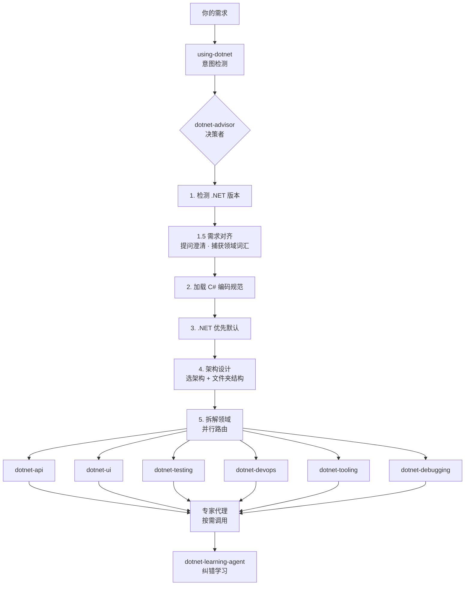

# dotnet-artisan

**让你的 AI 编码代理真正精通 .NET。** 即装即用，零配置。

[](README.en.md) [](LICENSE) 12 技能 · 14 代理 · 175 参考文件 · 30+ 行为

> **Grok / xAI 兼容优化版**：完整支持 Grok 的工具调用（GitHub MCP、sandbox bash、文件操作等）、增强插件在 AI 代理环境下的正常运行，并帮助项目持续学习新的 .NET + AI 知识。

---

## 简介

dotnet-artisan 是一个 Claude Code 插件，让 AI 编码代理能够正确地编写 .NET 代码。

它不是一个零散的工具集合，而是一个**完整的 .NET 开发智能体系统**。核心是一个决策者编排器，它会先分析需求、捕获领域词汇、设计架构，然后路由到对应技能去执行——从 API 搭建到调试崩溃，从安全审计到 CI/CD 配置，覆盖完整的开发生命周期。

装完即用，无需任何配置。 [Web 版 →](https://fenzel999.github.io/dotnet-artisan)

本项目学习并整合了 [dotnet/skills](https://github.com/dotnet/skills) 和 [novotnyllc/dotnet-artisan](https://github.com/novotnyllc/dotnet-artisan) 的优秀实践，在此致谢。

同时针对 **xAI Grok** 进行了优化：插件可在 Grok 的 sandbox + MCP 工具环境下稳定运行，支持自动学习新 .NET 特性到 skills/references，帮助人类用户高效上手。

---

## 安装

```bash
claude plugins marketplace add fenzel999/dotnet-artisan
claude plugins install dotnet-artisan
```

兼容 GitHub Copilot、VS Code、Cursor，以及 Grok（通过 MCP 工具调用）。装完打开任意 .NET 项目即用，Harness 自动激活（加载技能、路由提示、检查 30 秒法则）。

**2 分钟上手：** [QUICKSTART.md](QUICKSTART.md)

### 快速验证插件是否正常运行

1. 打开任意含 `.csproj` 或 `.sln` 的目录。
2. 输入：`这个项目用的什么 .NET 版本？`
3. 预期：AI 自动检测 TargetFramework 并回答。
4. 更多验证见 [GUIDE.md](GUIDE.md) 和 [skills/dotnet-workflow/references/plugin-verification.md](skills/dotnet-workflow/references/plugin-verification.md)。

---

## 工作流程

你提需求，决策者统一编排全过程：



**你不需要记任何技能名。** 决策者自动分析项目、对齐需求、加载规范、路由到正确的技能和代理。

在 Grok 环境下，决策者可利用 MCP 工具（GitHub、sandbox bash、file ops）进一步增强上下文获取与验证能力。

---

## 场景示例

### 1. 从零搭建订单管理系统

```
你：我需要一个订单管理系统

AI：什么样的订单？采购订单、工单还是顾客订单？谁在使用？
你：顾客下单，销售团队处理。未来可能会拆分订单和支付。

AI：建议从模块化单体开始，按领域拆项目但不拆部署。
    DDD 适合你的场景：订单、支付、库存作为限界上下文。
    你们之前用过 DDD 吗？
你：没有。

AI：我会先做战略设计——Event Storming 发现领域事件，
    划分限界上下文，输出领域分析文档。战术实现
    用聚合、实体、值对象。技术栈：.NET 10 + PostgreSQL。
你：好，需要 CI/CD 和测试。

行为链：4 轮提问 → dotnet-domain-analyst → Event Storming →
       限界上下文：[订单、支付、库存] → 输出领域文档 →
       并行路由 → dotnet-api + dotnet-testing + dotnet-devops + dotnet-tooling
```

### 2. 排查生产崩溃（内存溢出）

```
你：我的应用在生产环境一直崩溃——OutOfMemoryException
AI：有 .dmp 文件吗？
你：有，C:\\dumps\\crash.dmp

行为链：dotnet-debugging → 打开转储（WinDbg/dotnet-dump）→
       !analyze -v → !dumpheap -stat 发现 850MB byte[] →
       !gcroot 追溯到 ImageCache 单例 → 修复方案
```

### 3. 代码审查与安全审计

```
你：审查这段代码的安全性
AI：好的，只读安全审计，不修改代码。检查 OWASP Top 10。

行为链：dotnet-security-reviewer（只读）→ 扫描 → 发现
       SQL 拼接 + 硬编码密钥 + JWT 缺 Audience → 安全报告
```

### 4. 为现有代码补测试

```
你：给这个订单服务写测试
AI：核心逻辑适合单元测试，数据库需要集成测试。
    xUnit + WebApplicationFactory + Testcontainers 可以吗？
你：可以。

行为链：dotnet-testing → 创建测试项目 → 单元测试 →
       Testcontainers 启动 PostgreSQL → 集成测试
```

### 5. 从 .NET 8 升级到 .NET 10

```
你：把这个项目从 .NET 8 升到 .NET 10
AI：先做升级评估，分两步走：8→9 再 9→10，每步 build+test。

行为链：dotnet-devops → 8→9（BinaryFormatter 废弃）→
       build+test → 9→10（AddValidation）→ build+test
```

### 6. 配置 CI/CD 流水线

```
你：给这个项目配 CI/CD
AI：Web API + GitHub，生成 GitHub Actions 工作流，
    推送到 main 时触发部署。

行为链：dotnet-devops → 生成 GHA 工作流 → build+format+test+docker
```

### 7. 记住项目约定

```
你：记住，这个项目用 TimeProvider 而不是 DateTime.Now
AI：已捕获规则：TimeProvider 构造函数注入优先。
    适用于所有新代码，已存入 MEMORY.md。

行为链：dotnet-learning-agent → 检测纠错 → 泛化规则 →
       去重 → 写入 MEMORY.md → 确认
```

---

## 技能

| 分类 | 技能 | 定位 | 引用 |
|------|------|------|------|
| 网关 | [using-dotnet](skills/using-dotnet/SKILL.md) | 检测 .NET 意图，触发决策者 | — |
| | [dotnet-advisor](skills/dotnet-advisor/SKILL.md) | 决策者：需求对齐 → 架构设计 → 路由调度 | 2 |
| 基线 | [dotnet-csharp](skills/dotnet-csharp/SKILL.md) | C# 规范、async/await、DI、LINQ（始终加载） | 27 |
| 构建 | [dotnet-api](skills/dotnet-api/SKILL.md) | 后端 API、EF Core、gRPC、SignalR、安全 | 33 |
| | [dotnet-ui](skills/dotnet-ui/SKILL.md) | Blazor、MAUI、WPF、WinUI、Uno | 20 |
| 验证 | [dotnet-testing](skills/dotnet-testing/SKILL.md) | xUnit、集成测试、Playwright、基准测试 | 14 |
| | [dotnet-debugging](skills/dotnet-debugging/SKILL.md) | WinDbg / dotnet-dump 崩溃诊断 | 17 |
| 运维 | [dotnet-devops](skills/dotnet-devops/SKILL.md) | CI/CD、容器、版本迁移、Git 工作流 | 19 |
| | [dotnet-tooling](skills/dotnet-tooling/SKILL.md) | 项目结构、AOT、CLI、性能、代码质量、模板引擎 | 41 |
| 增强 | [dotnet-ai](skills/dotnet-ai/SKILL.md) | MCP 服务器、Semantic Kernel、RAG、**xAI Grok 集成** | — |
| | [dotnet-workflow](skills/dotnet-workflow/SKILL.md) | 并行工作流、上下文管理、验证循环 | 1 |
| | [dotnet-grok](skills/dotnet-grok/SKILL.md) | Grok MCP 工具、插件维护、学习闭环、健康检查 | 1 |

---

## 参考文件

175 个参考文件，横跨 10 个领域。每个文件：核心原则 → 模式 → 反模式 → 决策指南。

| 领域 | 技能 | 数量 | 覆盖 |
|------|------|------|------|
| API 与后端 | dotnet-api | 33 | Minimal API、EF Core、gRPC、SignalR、安全、缓存、消息、YARP |
| C# 语言 | dotnet-csharp | 27 | async/await、DI、LINQ、序列化、并发、领域建模、源码生成 |
| 调试 | dotnet-debugging | 17 | WinDbg、dotnet-dump、lldb、崩溃分析、死锁、高 CPU |
| DevOps | dotnet-devops | 19 | CI/CD、容器、NuGet、OpenTelemetry、版本迁移、Git 工作流 |
| 测试 | dotnet-testing | 14 | xUnit、集成测试、Playwright、BDD、基准测试、快照 |
| 工具链 | dotnet-tooling | 41 | MSBuild、AOT、CLI、性能分析、模板引擎、PR 工作流 |
| UI | dotnet-ui | 20 | Blazor、MAUI、Uno、WPF、WinUI、WinForms |
| 路由 | dotnet-advisor | 2 | 需求对齐、架构发现 |
| 工作流 | dotnet-workflow | 1 | 插件验证 |
| Grok | dotnet-grok | 1 | 知识晋升 / MCP 维护 |

完整索引：[INDEX.md](skills/INDEX.md)

---

## 行为

30+ 个预设行为，按目标组织，决策者自动路由：

| 分类 | 行为示例 | 路由到 |
|------|---------|--------|
| 搭建 | 创建 API / Blazor / MAUI / CLI 应用 | dotnet-api/ui + tooling + testing |
| 修复 | 调试崩溃 / 分析死锁 / 内存泄漏 / 高 CPU | dotnet-debugging |
| 审查 | 代码审查 / 安全审计 / 架构评估 | code-review-agent / security-reviewer / architect |
| 测试 | 单元测试 / 集成测试 / E2E / 基准测试 | dotnet-testing + testing-specialist |
| 交付 | CI/CD / 容器化 / NuGet 发布 / 部署 | dotnet-devops + cloud-specialist |
| 升级 | .NET 版本迁移 / AOT 迁移 | dotnet-devops + dotnet-tooling |
| 学习 | 记住项目约定 / 捕获纠错 | dotnet-learning-agent |
| 维护 | Grok/MCP 维护本插件 | dotnet-grok |

全部行为及路由逻辑：[BEHAVIORS.md](BEHAVIORS.md)

---

## 代理

### 角色型代理

像人类专家一样工作。理解上下文，做出判断，解释推理。

| 代理 | 定位 | 模式 |
|------|------|------|
| [architect](agents/dotnet-architect.md) | 架构师 — 架构选型、文件夹结构、构建配置 | 只读 |
| [domain-analyst](agents/dotnet-domain-analyst.md) | 领域分析师 — 事件风暴、限界上下文、领域文档 | 读写 |
| [code-review-agent](agents/dotnet-code-review-agent.md) | 代码审查员 — 正确性、性能、安全、架构 | 只读 |
| [security-reviewer](agents/dotnet-security-reviewer.md) | 安全审计员 — OWASP、密钥、加密（只读） | 只读 |
| [testing-specialist](agents/dotnet-testing-specialist.md) | 测试架构师 — 策略、测试数据、金字塔设计 | 只读 |
| [docs-generator](agents/dotnet-docs-generator.md) | 技术文档工程师 — DocFX、Mermaid、XML 文档 | 读写 |

### 工具型代理

执行特定技术深度分析。聚焦单一领域。

| 代理 | 定位 | 模式 |
|------|------|------|
| [aspnetcore-specialist](agents/dotnet-aspnetcore-specialist.md) | 中间件、DI、请求管道 | 只读 |
| [ui-specialist](agents/dotnet-ui-specialist.md) | Blazor / MAUI / Uno 跨平台 UI | 只读 |
| [performance-specialist](agents/dotnet-performance-specialist.md) | 异步、性能分析、基准测试 | 只读 |
| [concurrency-specialist](agents/dotnet-csharp-concurrency-specialist.md) | 竞态条件、死锁、线程安全 | 只读 |
| [code-lifecycle-agent](agents/dotnet-code-lifecycle-agent.md) | 构建错误 + 质量清理流水线 | 读写 |
| [cloud-specialist](agents/dotnet-cloud-specialist.md) | Aspire、AKS、云部署 | 只读 |
| [dotnet-learning-agent](agents/dotnet-learning-agent.md) | 纠错捕获、模式泛化、记忆管理 | 读写 |
| [pr-workflow](agents/dotnet-pr-workflow.md) | PR 生命周期：创建 → 审查 → 合并 → 发布 | 读写 |

---

## Grok / xAI 特别说明

- **工具兼容**：插件设计与 Grok 的 MCP 工具（GitHub、sandbox、web_search 等）天然兼容。决策者可调用这些工具获取仓库状态、执行 `dotnet` 命令、验证构建。
- **学习新知识**：通过 `dotnet-learning-agent` + `dotnet-grok` + Grok 工具，可自动捕获新 .NET 特性、反模式，并更新 skills/references。
- **正常运行保障**：Hooks 零阻塞；所有技能为只读/增量修改，不会破坏现有项目。详见 GUIDE.md。
- **人类友好**：完整中文/英文文档、场景示例、验证清单，帮助人类快速上手插件。

---

## 了解更多

- [QUICKSTART.md](QUICKSTART.md) — **2 分钟验证插件能不能跑**：安装、排障、学习闭环
- [LEARNING.md](LEARNING.md) — **帮项目学新知识**：三层记忆（MEMORY.md → skills/references → 插件维护）
- [USAGE.md](USAGE.md) — 先理解再动手：7 项检查清单、4 轮提问框架、领域驱动分析
- [设计原则](skills/CHEATSHEET.md) — DbContext 即仓储、禁止 FluentValidation、TimeProvider 等核心规范
- [BEHAVIORS.md](BEHAVIORS.md) — 全部行为目录、决策者路由逻辑、代理触发词
- [CLAUDE.md](CLAUDE.md) — 插件架构、文件地图、上下文恢复协议
- [GUIDE.md](GUIDE.md) — **插件满血使用指南**：安装验证、各技能技巧、高级功能、实战场景、常见问题

---
